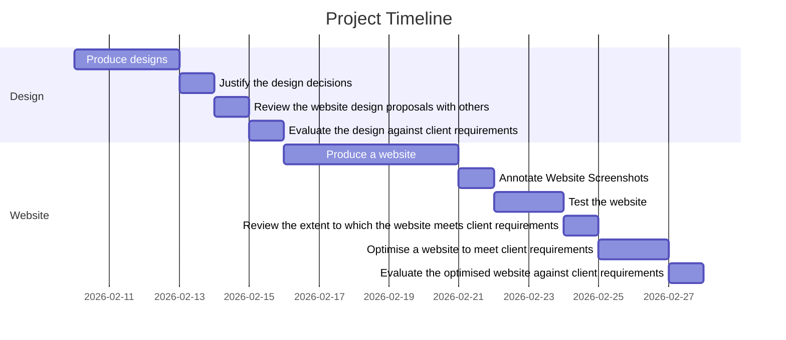

# Unit 15 Assignment 2

... to be added ...

## Planning

## User Requirements

### Website features

[ ] A profile of the company itself

[ ] Profiles of existing trainee web developers

[ ] Job specifications and required qualifications

[ ] An online application form

[ ] Links to web development courses

### Other

The target audience for the site is people who have completed training courses or qualifications related to web development and are now looking for a job as a web developer.

 

## Design of the website

### Design 1

Completed 10/02

 

### Design 2

Completed 13/02

### Justify the design decisions, explaining how they will meet the user's needs and be fit for purpose

### Feedback on designs

 

## Testing

https://www.lambdatest.com/learning-hub/cypress-javascript

### Unit testing code

### CSS Testing

https://jigsaw.w3.org/css-validator/

### HTML Testing

https://validator.w3.org/nu/

### Browser Compatibility

(Screenshots side by side of browsers)

Test load speeds
