# Unit 15 Assignment 2

## Table of Contents

- [Unit 15 Assignment 2](#unit-15-assignment-2)
  - [Table of Contents](#table-of-contents)
  - [Planning](#planning)
  - [Client Requirements](#client-requirements)
    - [Features](#features)
    - [Extra Features](#extra-features)
    - [User Needs](#user-needs)
    - [Target Audience](#target-audience)
  - [Design of the website](#design-of-the-website)
    - [Design 1](#design-1)
    - [Design 2](#design-2)
    - [Justify the design decisions, explaining how they will meet the user's needs and be fit for purpose](#justify-the-design-decisions-explaining-how-they-will-meet-the-users-needs-and-be-fit-for-purpose)
    - [Review the website design proposals with others to identify and inform improvements](#review-the-website-design-proposals-with-others-to-identify-and-inform-improvements)
      - [Feedback 1](#feedback-1)
      - [Feedback 2](#feedback-2)
  - [Evaluate the design against client requirements](#evaluate-the-design-against-client-requirements)
  - [Screenshots of website](#screenshots-of-website)
  - [Review the extent to which the website meets client requirements](#review-the-extent-to-which-the-website-meets-client-requirements)
  - [Testing the website](#testing-the-website)
    - [Test Plan](#test-plan)
      - [Functionality](#functionality)
      - [Compatibility](#compatibility)
      - [Usability](#usability)
    - [Load Speeds](#load-speeds)
    - [Unit Testing](#unit-testing)
      - [CSS](#css)
      - [HTML](#html)
    - [Browser Compatibility](#browser-compatibility)
      - [Firefox](#firefox)
      - [Edge](#edge)
      - [Chrome](#chrome)
    - [Testing Links/Buttons](#testing-linksbuttons)
    - [Testing Application Form](#testing-application-form)
    - [User Feedback](#user-feedback)
  - [Optimise a website to meet client requirements](#optimise-a-website-to-meet-client-requirements)
    - [Page specific CSS](#page-specific-css)
      - [Unoptimised CSS file](#unoptimised-css-file)
      - [Optimised CSS file](#optimised-css-file)
  - [Evaluate the optimised website against client requirements](#evaluate-the-optimised-website-against-client-requirements)
  - [Demonstrate individual responsibility, creativity and effective self-management in the design, development, and review of a website](#demonstrate-individual-responsibility-creativity-and-effective-self-management-in-the-design-development-and-review-of-a-website)

## Planning

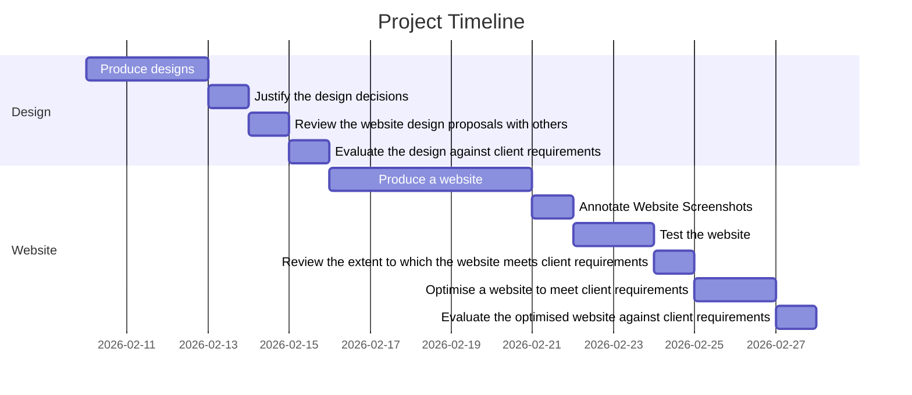

## Client Requirements

### Features

[ ] A profile of the company itself

[ ] Profiles of existing trainee web developers

[ ] Job specifications and required qualifications

[ ] An online application form

[ ] Links to web development courses

[ ] Well-maintaned code

### Extra Features

[ ] Collect contact details & CV in application form

[ ] Names, roles, and biographies for 5 different employees

[ ] Web development courses of varying skill levels

### User Needs

[ ] Easy to navigate

[ ] Clear call to action buttons

[ ] All links/buttons working

[ ] Uncluttered design

[ ] Consistent visual elements

### Target Audience

The target audience for the site is people who have completed training courses or qualifications related to web development and are now looking for a job as a web developer.

 

## Design of the website

### Design 1

Completed 10/02

 

### Design 2

Completed 13/02

 

### Justify the design decisions, explaining how they will meet the user's needs and be fit for purpose

User needs are expectations of potential website users that focus on usability, accessibility, and information architecture. The design decisions made meet user needs such as ease of navigation, clear call to action buttons, uncluttered design, and consistent visual elements.

The simple, uncluttered layout allows for easier navigation and retrieval of information as well as improving the user's focus, and also means that loading times are faster especially on slower connections. Furthermore, an uncluttered layout projects a professinal, efficient image for the brand and allows for emphasis on key content.

The contrasting colours between the text and background improve the website's readability. The colour palette is simple and consistent, strengthening brand recognition and consistency- the muted tones in design 2 reflect sophistication and professionalism, while the vibrant colours in design 1 convey a youthful and energetic brand. Design 2's colour scheme may be more appropriate for the intended audience, which is professionals that have completed a qualification and are looking for a job as a web developer.

The clear calls to action meet user needs by guiding the user towards desired actions (Apply now, contact, etc), and simplifies decision-making. It reinforces the desired user interaction.

The typography is consistent- it improves readability and information hierarchy, and crafts a cohesive visual experience. It establishes a brand personality/voice through font choices.

The use of many images and visuals (represented by grey circles/squares in the designs) enhances the user's engagement with the content, breaking up the text and adding more visual interest. It also showcases the services that are on offer in an appealing way and conveys the brand's personality through visuals. The images will create a welcoming, friendly atmosphere for the website.

 

### Review the website design proposals with others to identify and inform improvements

#### Feedback 1

"Design 2 is more sleek and professional, which I think is important in website design. While the colourful one (design 1) is more fun and interesting to look at, it becomes a bit excessive with the amount of shapes that it has and my eyes don't know where to look. Design 2 is the better design, but could use a different font as it looks strange especially on the 'Apply Now' button." (Feedback from Ella)

#### Feedback 2

"Design 2 is easy to use and accessible with the high contrast text and backgrounds. The colours are satisfying and the layout is streamlined. However, there could be a greater variety in colours to make the text stand out more." (Feedback from Aksel)

**Based on the feedback, I decided to proceed with Design 2.** It has a more professional feel, as well as having a layout that allows information to be found easily.

 However, as highlighted in the feedback, improvements that could be made when creating the website from this design include a better font and a greater variety in colours (this could be incorporated with images).

 

## Evaluate the design against client requirements

Client requirements are objectives provided by the client for the website, and they focus on functionality, content, and technical aspects of the website.

The design meets the majority of client requirements with its inclusion of a company profile in the 'about us' section, highlighted on the home page. It also includes job specifications and required qualifications, a section for links to web development courses where there are multiple boxes for different courses to be implemented, and trainee profiles that have two headers for names and roles as well as accompanying text for biographies.

However, not all client requirements are met by the design: a design for the application form has not been created, which is a shortcoming that fails to completely align the website's designs with the client requirements that have been set. Although I had intended to link the application form to the 'Apply Now' button on the design's job page, this is not immediately obvious to other people looking at the designs and should have been made clearer. The lack of design for an application form means that the form page would need to be improvised, which could lead to inconsistent visual elements (which is a user need).

Overall, the design meets most client requirements as it encompasses features like a company profile, employee profiles, job specifications and qualifications, and links to courses. It fails to show a design for an application form. This is an oversight that means the form will need to be improvised as the website is created. The application form is not well-planned, putting it at risk of not meeting user needs.

## Screenshots of website

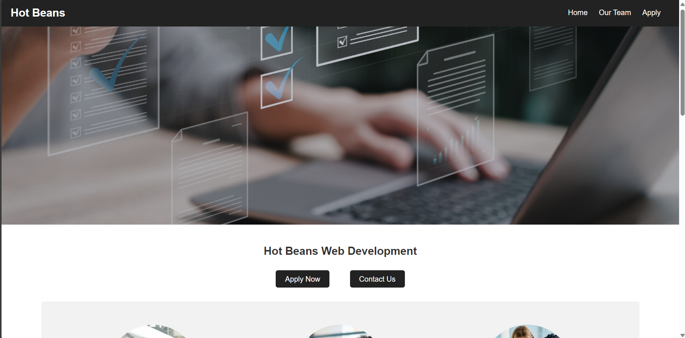

*Each page has a simple, easy to understand navigation bar along with a large banner (free to use stock image) that brings more visual interest to the website.*

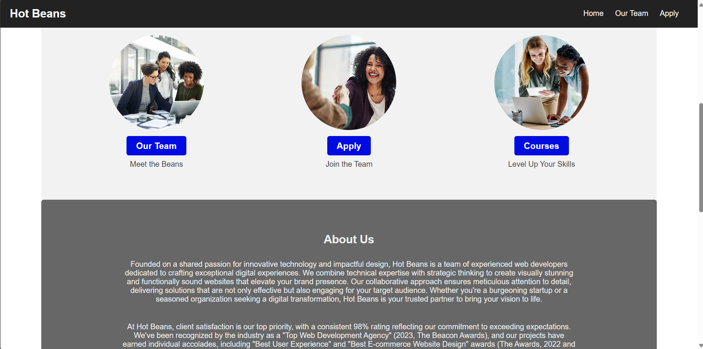

*There is an about us section- text has been generated by Gemini, but prompts have been provided to tailor the 'voice' of the website to suit the target audience, which is new graduates (often young adults) that have finished a qualification and are looking for a web development job.*  

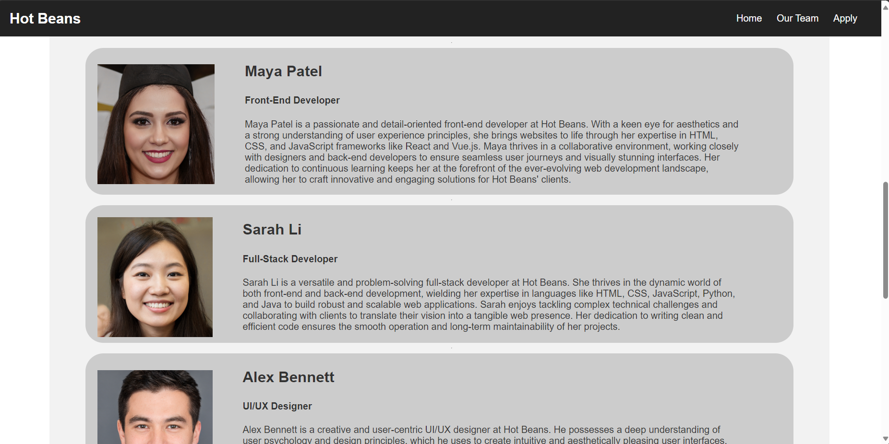

*Each team member profile image was generated on the website '[This Person Does Not Exist](https://thispersondoesnotexist.com/)', which produces AI generated fake photos of a random human face.*

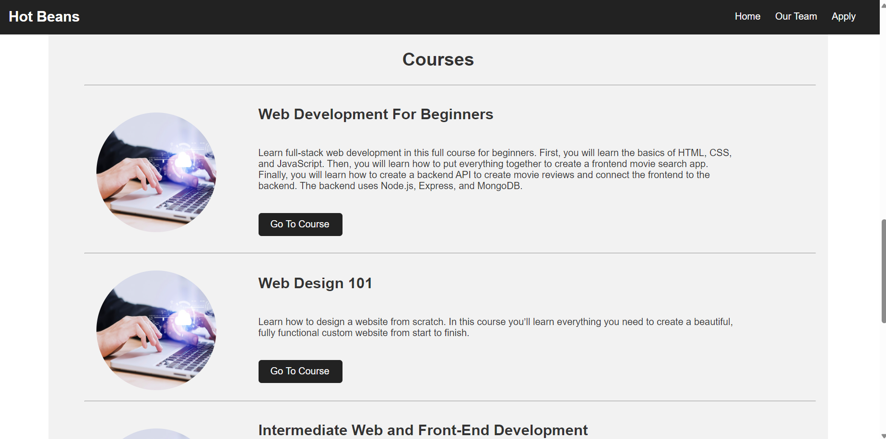

*Courses include a range of skill levels- they link to courses from websites like Youtube and Coursera.*

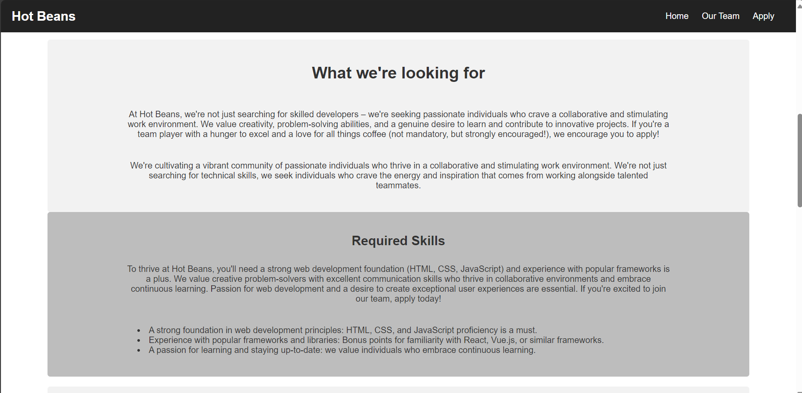

*The job specifications and qualifications have been AI generated.*

 

## Review the extent to which the website meets client requirements

The website mostly meets the client requirements. It includes a section for a company profile (an about us section), trainee profiles with their names, roles, and biographies, job specifications with required qualifications, and on online application form with fields to input contact details as well as CV upload functionality. The website offers a user-friendly experience with clear and simple navigation- the navigation bar and section headings both contribute to user-friendliness and ease of finding information. It has fully functioning links and buttons, and the call to action buttons use clear, concise language to direct users to take action ("Apply Now", "Learn More"). It has an uncluttered design aided by consistent spacing and margins, and consistent visual elements, including links to web development courses of varying skill levels. These features encompass a majority of the client/user requirements that have been stated.

However, there is one element the website falls short on: well-maintained code. The CSS especially is not very well maintained, which contradicts an explicit client requirement. This could lead to issues such as bugs and difficulties in managing and updating the site in future.

Overall, while the website succeeds in meeting the majority of the client requirements, it is essential to address the poorly maintained code- this will ensure that the code for the website is robust and easily manageable. For this reason, in order to optimise the website, I will need to prioritise cleaning up the code; this will then lead to all client requirements being met by the website.

 

## Testing the website

### Test Plan

#### Functionality

- Test load speeds.
- Unit test code- test CSS and HTML using w3 validators.

#### Compatibility

- Test browser compatibility (screenshots side by side of browsers).

#### Usability

- Test the links and buttons on the pages to ensure they direct to the correct place.
- Test the application form - mandatory field validation and input validation.
- User feedback

 

### Load Speeds

The results on [Lighthouse](https://lighthouse-metrics.com/lighthouse/checks/aab52577-4c3a-4076-8868-a6e51cbd897a) show that the website's performance is below average.

Several factors could contribute to the performance of my website. Large, uncompressed images, unused or redundant CSS code adding weight to the page, network issues, and netlify settings configuration may be impacting the website's load times and rendering. These metrics could be improved by removing unused CSS and explicitly setting widths and heights for images, or using image compression tools.

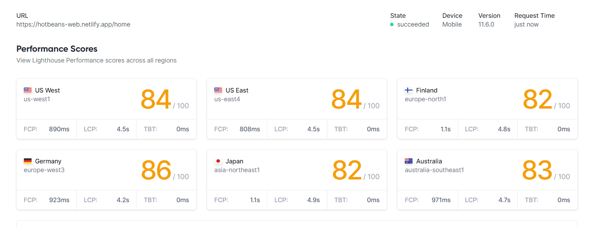

### Unit Testing

#### CSS

Using the [w3 CSS validator](https://jigsaw.w3.org/css-validator/), 2 errors were found in src/css/style.css

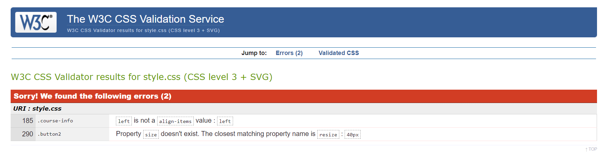

#### HTML

Using the [w3 HTML validator](https://validator.w3.org/nu/), 8 errors were found in src/html/home.html

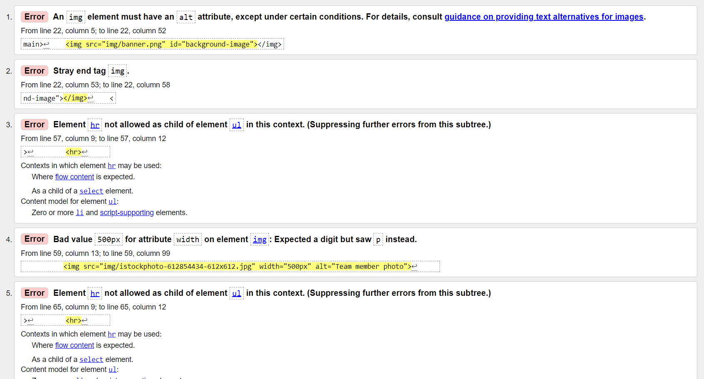
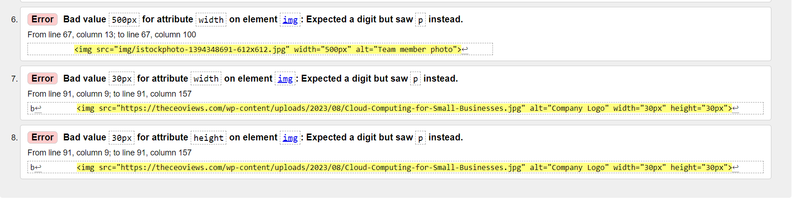

### Browser Compatibility

To ensure a seamless experience for users, I tested the website across various browsers including Firefox, Edge, and Chrome. This testing verified consistent functionality and visual presentation across different platforms.

#### Firefox

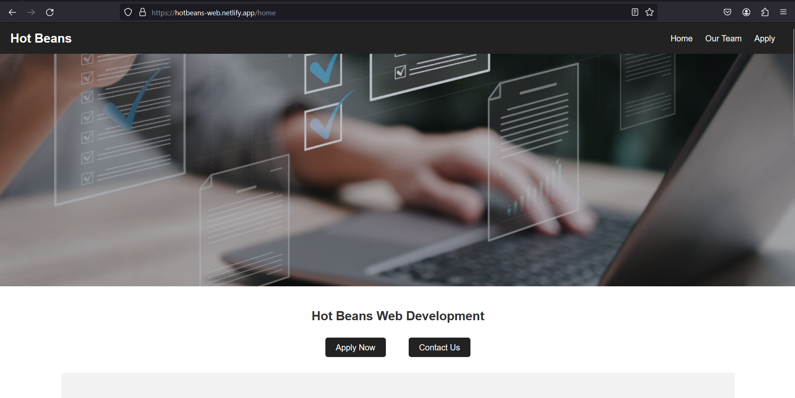

On Firefox, the images load noticeably more slowly than other browsers like Edge and Google. This links back to the Lighthouse metrics, which indicated poor load speeds.

#### Edge

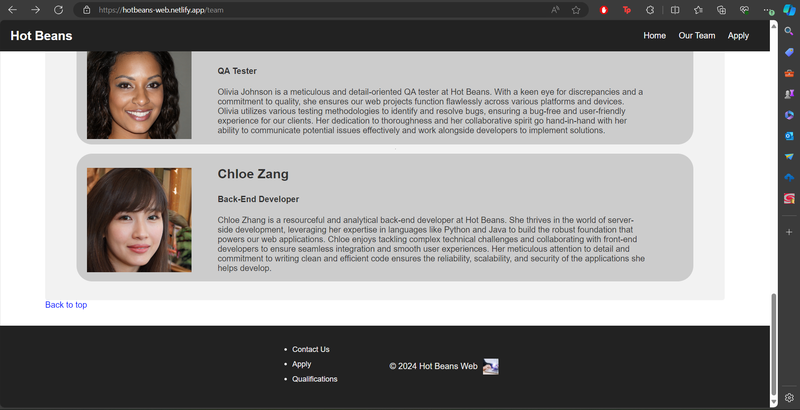

#### Chrome

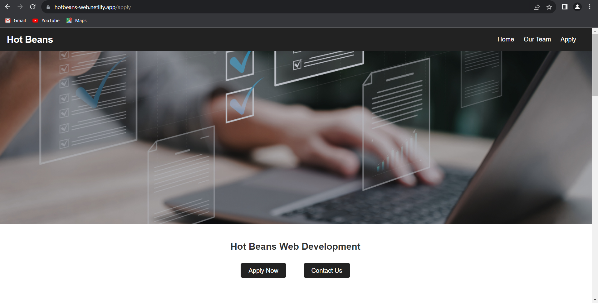

### Testing Links/Buttons

On the navigation bar, all links are functional. However, on the footer, there are links to pages that don't direct the user to the correct page when clicked. Another issue is the 'Contact Us' button, which leads nowhere- I have not created a page that contains contact details for the company. The 'submit' button on the application form leads to an error. From this test, I can see that the footer, the 'Contact Us' button, and the 'Submit' button are non-functional and need to be fixed.

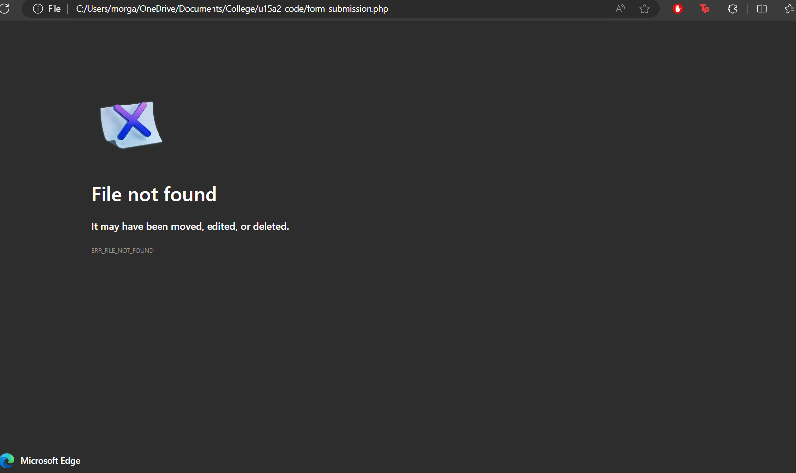

### Testing Application Form

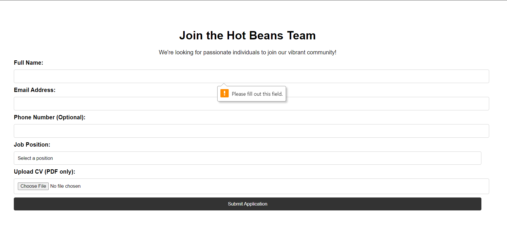

As intended, the application form flags when fields have been left empty, succeeding tests for mandatory field validation.

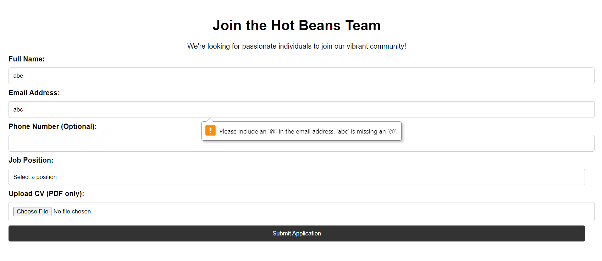

The application form also flags when a field has incorrect input, succeeding tests for input validaiton.

### User Feedback

"The website is very user-friendly and easy to navigate, I found all of the information I was looking for quickly and easily."

"The website looks great on my laptop, but not so much on my phone."

"The website is easy to read and use because of the clean design and uncluttered layout."*

From the user feedback, I gather that the successes of the website include ease of navigation and a clear, intuitive layout which contribute to good usability for the website.

However, an area that needs to be looked into is cross-platform compatibility. The website is difficult to navigate on mobile as it is too wide, meaning that (for instance) the user needs to scroll horizontally in order to access the full navigation bar, making it more difficult to navigate to different pages.

 

## Optimise a website to meet client requirements

To optimise my website, I will address the client requirement that has not been met: well-maintained code. Although the appearance of the website won't change, the code will see improvements in its structure.

The CSS files in particular are an issue- in the unoptimised website there are only two files, style.css (used in home.html, apply.html, and team.html) and form-style.css (used in application-form.html). Style.css is 322 lines long as a result of this, many of which are unused or redundant and could contribute to slow load speeds for the website. With optimisation, the website may gain improved performance metrics.

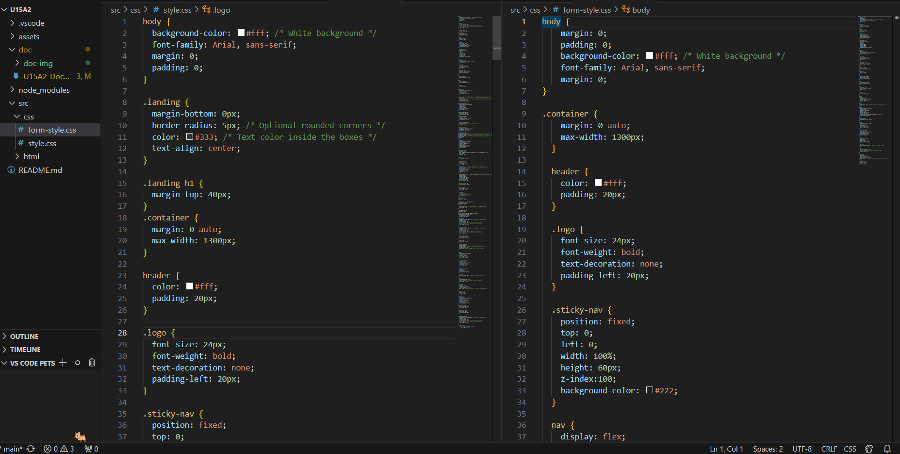

To optimise the website, I will split the CSS into separate files. I will create a file for base styles named styles.css, which will hold all common styles shared across all pages and will be included in the head section of each HTML file. Styles.css will contain styles for: body, container, header, navigation (logo, sticky-nav, nav-links, etc), general text styles for headings (h1, h2, h3) and paragraphs, and footer. In the process, I will remove unused CSS and condense CSS that is repeated for multiple different elements, sharing it across them instead.
I will also add ALT text to the HTML files where it is missing in order to abide by accessibility guidelines, better meeting user needs.

### Page specific CSS

homepage.css:

- Hero section styles
- Key features styles
- Specific styles for sections unique to home page
form-style.css:
- Application form styles
teampage.css:
- Team members styles
- Specific styles for sections unique to team page

#### Unoptimised CSS file

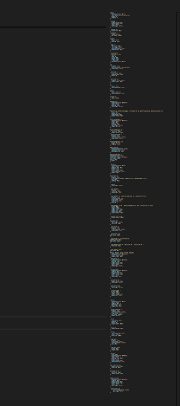

#### Optimised CSS file

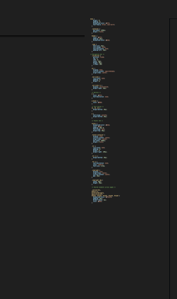

 

## Evaluate the optimised website against client requirements

Following the optimisations to the website, the designs and website now adhere to all client requirements and user needs. The user-friendliness is further enhanced by the maintainability of the code. The code optimisation stands out as it impacts maintainability and performance significantly. Redundant or unused CSS has been removed, and repeated CSS has been condensed and shared efficiently across elements. The CSS stylesheet has been split into separate files:

- styles.css: Encompasses all pages and styles common elements
- teampage.css: Applies specifically to the team page
- homepage.css: Applies specifically to the home page
- form-style.css: Manages styles for the application form

This organisation not only improves code maintainability but also allows for targeted modifications without affecting other pages or functionalities, making the website much easier to update. Furthermore, the CSS incorporates comments labelling sections which improve the clarity of the code and maintainability for future development- other developers will be able to read the comments and better understand the code. The HTML also includes ALT text for all images, improving accessibility.

To conclude, the optimised website with its maintainable code, user-friendly design and comprehensive content now align with the complete list of client/user requirements that had been outlined. That being said, the website could still benefit from testing for functionality, compatibility, and usability.

 

## Demonstrate individual responsibility, creativity and effective self-management in the design, development, and review of a website

By making a Gantt chart using Mermaid as a creative way to plan and track my progress throughout the design, development and review of the website, I was able to take an more organised approach to the project and manage my time effectively, sharing my workload across a manageable schedule. There were aspects of the assignment that required more time to work on than I'd originally planned for, but I was able to complete those tasks while simultaneously beginning to work on others, overlapping them with ease. For the most part, I met my targets as I had planned them in the Gantt chart.

Although I faced issues with committing changes to my repository from my home PC due to my unfamiliarity with the way GitHub works, I researched to brush up on my knowledge of it and was able to solve this problem (by cloning my repository). This might seem simple, but it was a notable learning curve for me. On GitHub I have also tracked issues that I came across in the development of my website, finding solutions to each one and closing them with detailed comments.
